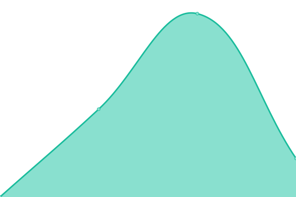

# [📈 Live Status](https://demo.upptime.js.org): <!--live status--> **🟩 All systems operational**

This repository contains the open-source uptime monitor and status page for [Upptime](https://upptime.js.org), powered by [Upptime](https://github.com/upptime/upptime).

With [Upptime](https://upptime.js.org), you can get your own unlimited and free uptime monitor and status page, powered entirely by a GitHub repository. We use [Issues](https://github.com/upptime/upptime/issues) as incident reports, [Actions](https://github.com/upptime/upptime/actions) as uptime monitors, and [Pages](https://demo.upptime.js.org) for the status page.

<!--start: status pages-->
<!-- This summary is generated by Upptime (https://github.com/upptime/upptime) -->
<!-- Do not edit this manually, your changes will be overwritten -->

| URL                                                                                   | Status | History                                                                                                 | Response Time                                                                     | Uptime                                                                                                                                                                                                                                       |
| ------------------------------------------------------------------------------------- | ------ | ------------------------------------------------------------------------------------------------------- | --------------------------------------------------------------------------------- | -------------------------------------------------------------------------------------------------------------------------------------------------------------------------------------------------------------------------------------------- |
| [GuessEU](https://www.guess.eu)                                                       | 🟩 Up  | [guess-eu.yml](https://github.com/HoscoHarding/P-ginasPrueba/commits/master/history/guess-eu.yml)       |  1633ms    |        |
| [GuessCA](https://www.guess.com/ca/en/home/?changeCountry=1)                          | 🟩 Up  | [guess-ca.yml](https://github.com/HoscoHarding/P-ginasPrueba/commits/master/history/guess-ca.yml)       |  608ms     |        |
| [GuessNa](https://www.guess.com/us/en_US/home/?changeCountry=1)                       | 🟩 Up  | [guess-na.yml](https://github.com/HoscoHarding/P-ginasPrueba/commits/master/history/guess-na.yml)       |  255ms     |        |
| [MarcianoEU](https://www.guess.eu/fr-fr/marciano?INTCMP=REFRESH_SUMMER_HERO_WOMEN_ES) | 🟩 Up  | [marciano-eu.yml](https://github.com/HoscoHarding/P-ginasPrueba/commits/master/history/marciano-eu.yml) |  1292ms |  |

<!--end: status pages-->

[**Visit our status website →**](https://demo.upptime.js.org)

## 📄 License

- Code: [MIT](./LICENSE) © [Upptime](https://upptime.js.org)
- Data in the `./history` directory: [Open Database License](https://opendatacommons.org/licenses/odbl/1-0/)
